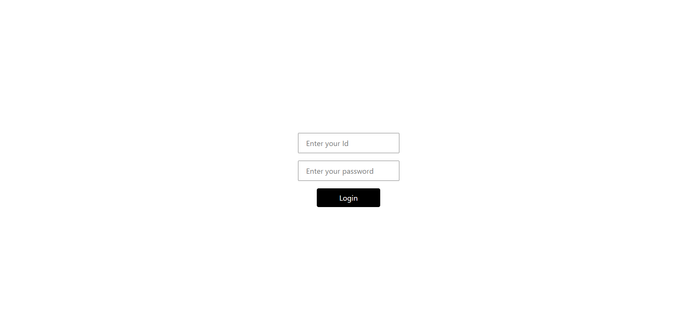
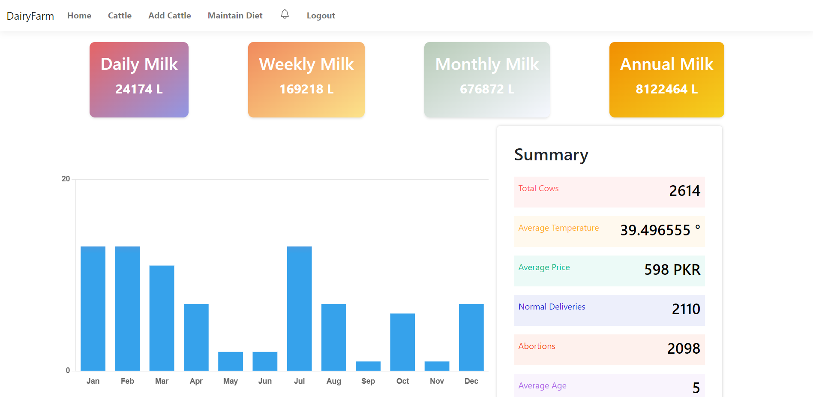
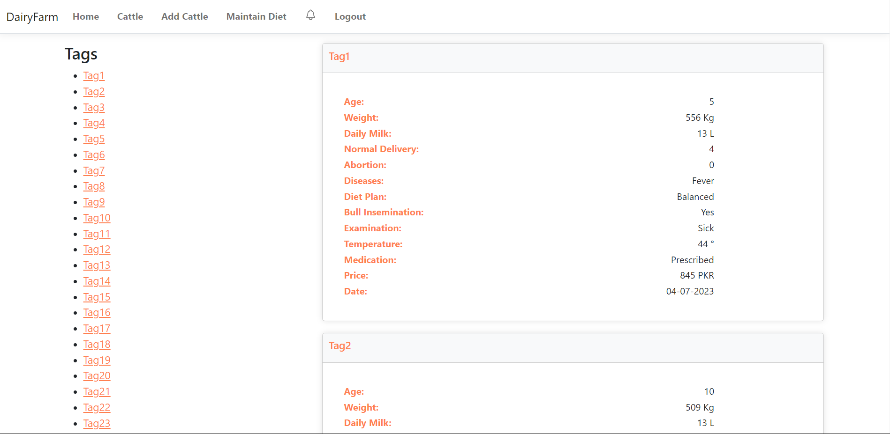
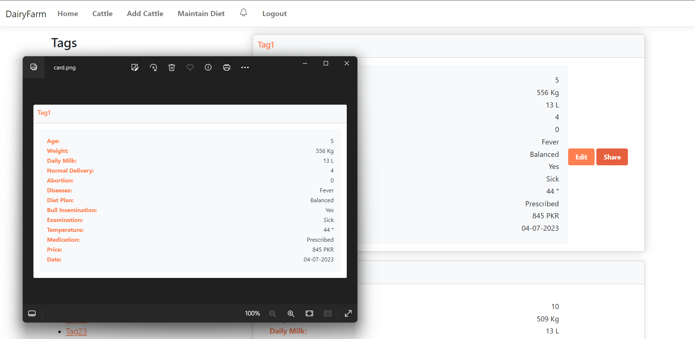
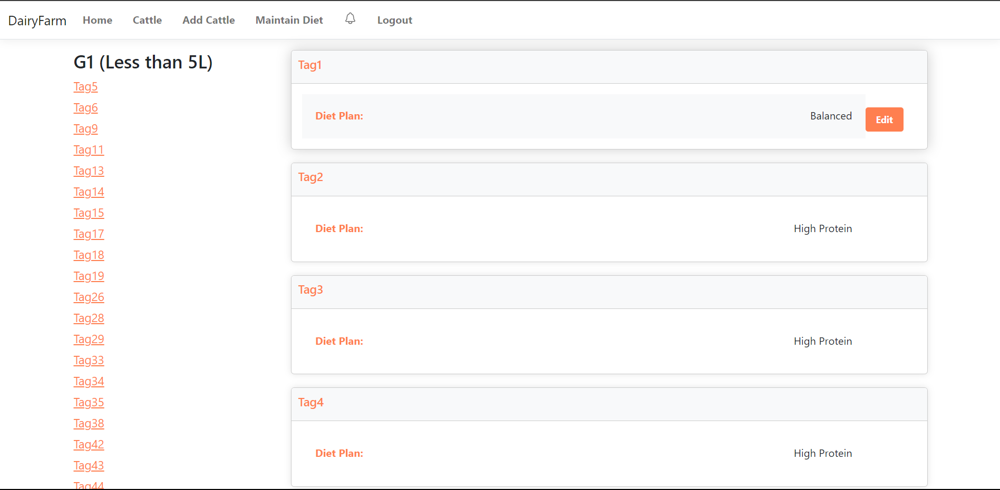

# DairyFarm Website

Welcome to the DairyFarm website repository! This website is designed to help dairy farmers manage their cattle, track their health, and streamline farm operations.

## Screenshots

### Login Page

### Website Dashboard

### Cattle Details Page

### Add Cattle Page

### Edit Cattle Page

### Print Cattle Details

### Cattle's Diet Page

## Description

This DairyFarm website is built using .NET framework with C# as the primary programming language. It offers various features to dairy farmers including:

- User authentication for secure login
- CRUD operations for managing cattle information
- Detailed cattle profiles including health records and diet plans
- Printable cattle details for offline reference
- Dashboard for an overview of farm activities

## Technologies Used

- .NET Framework
- C#
- HTML/CSS
- JavaScript
- SQL Server

## Getting Started

To run this project locally, follow these steps:

1. Clone this repository.
2. Open the project in Visual Studio (or your preferred IDE).
3. Restore NuGet packages if necessary.
4. Set up the database connection and ensure it's properly configured.
5. Build and run the project.

## Contributing

Contributions are welcome! If you have any suggestions, improvements, or bug fixes, feel free to open an issue or create a pull request.

## License

This project is licensed under the [AizazC9](LICENSE).
